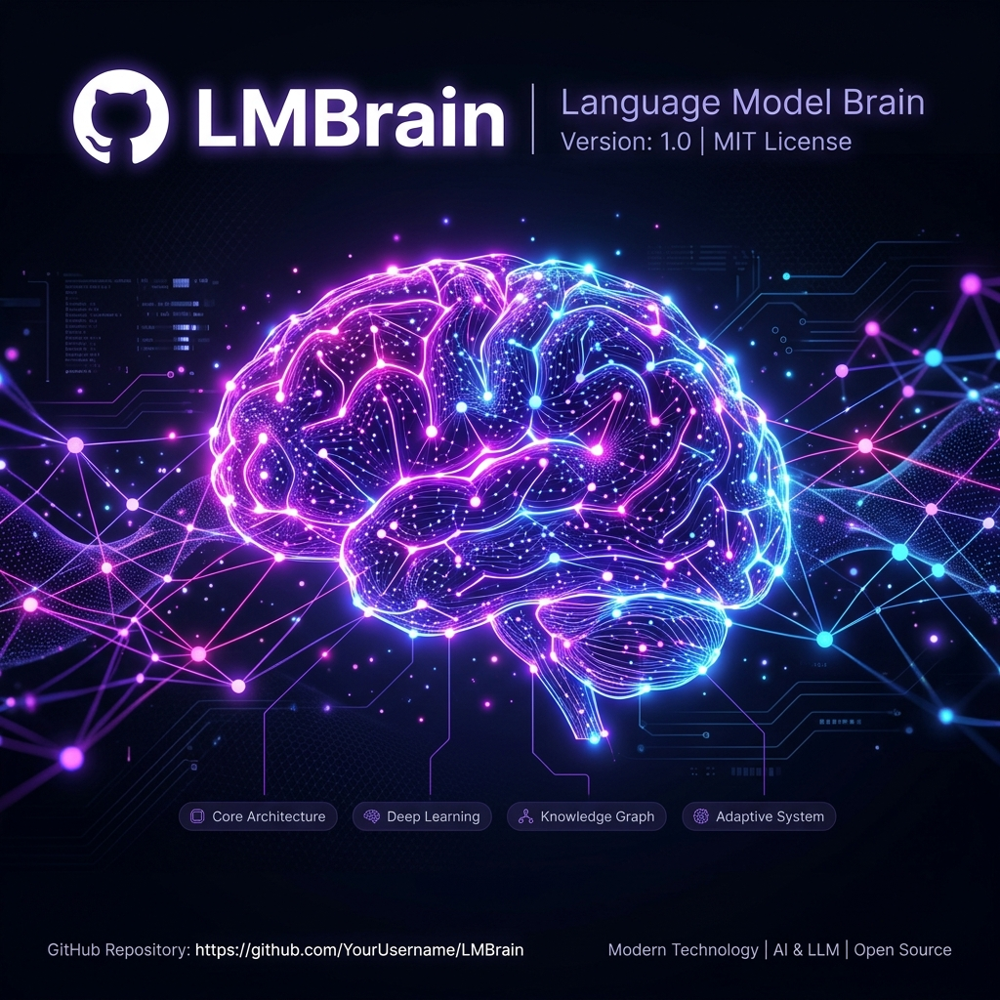
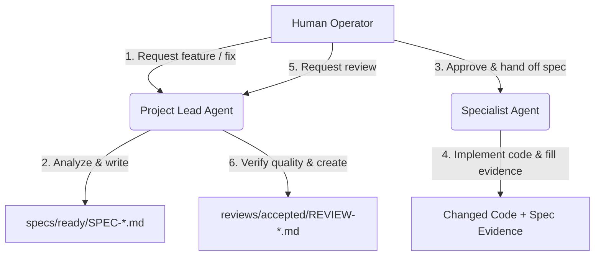

<p align="center">
  
</p>

<p align="center">
  <a href="https://github.com/fathorMB/LMBrain/actions/workflows/build-installers.yml">
    
  </a>
  <a href="https://github.com/fathorMB/LMBrain/releases">
    
  </a>
  <a href="https://tauri.app/">
    
  </a>
  <a href="https://opensource.org/licenses/MIT">
    
  </a>
</p>

---

# 🧠 LMBrain

**LMBrain** (Local Markdown Project Brain) is an agentic, portable, and git-friendly project management system. It provides a standardized framework where a virtual **Project Lead** AI agent coordinates analysis, roadmap planning, specialist handoffs, and quality reviews, while development tasks are offloaded to specialized **specialist agents** (or human developers). 

Everything is stored locally in clean, human-readable Markdown files inside the `.lmbrain/` directory. The project also includes a beautiful cross-platform desktop visualizer app.

---

## ✨ Key Features

- 🧠 **Dual-Agent Architecture**: Clear separation of concerns. The *Project Lead* designs specifications, coordinates the backlog, and reviews work, while *Specialist* agents write production-grade code.
- 📂 **Markdown-as-State**: No databases, no web APIs, no lock-in. Your project's status, roadmaps, task boards, agent profiles, and architecture decision records (ADRs) live inside your git repository in plain text.
- 🖥️ **Desktop Visualizer**: A sleek desktop app built using **Tauri**, **React**, and **TypeScript** that displays your Markdown project brain as a rich dashboard, task card deck, and interactive wiki.
- 🚀 **Automated Release Pipeline**: Pre-configured CI/CD workflow that validates version alignment across all packages, runs test suites, and automatically compiles production installers for Windows (`.exe`, `.msi`) and Linux (`.AppImage`, `.deb`).

---

## 🔄 How it Works: The Operator Workflow

LMBrain keeps you in complete control. Agents do not start automatically; you launch them and hand off Markdown files manually.



1. **Request a Feature**: Manually run the **Project Lead** and ask it to analyze your repository for a new feature.
2. **Review the Specification**: The Project Lead generates a detailed `SPEC-*.md` outlining the code changes, risks, and required specialist.
3. **Execute**: Hand off the spec to a **Specialist** agent (e.g. *Fullstack Desktop Specialist*) who writes the code and fills in the implementation evidence.
4. **Approve & Close**: Ask the Project Lead to review the finished work. It checks the code against the spec and `QUALITY.md` rules, producing a `REVIEW-*.md` to mark it `accepted` or `changes-requested`.

---

## 📁 Repository Structure

* [`.github/workflows/`](file:///.github/workflows/build-installers.yml): Automated installer build and release publisher.
* [`.lmbrain/`](file:///.lmbrain/): The active project brain governing LMBrain's own development.
* [`app-design/`](file:///app-design/): HTML/CSS layouts, UI design systems, and visual mockups.
* [`kit/.lmbrain/`](file:///kit/.lmbrain/): The clean, reusable starter kit template (version `1.0.5`) to bootstrap new projects.
* [`scripts/`](file:///scripts/): Tooling for validation and version-alignment checks.
* [`src/`](file:///src/) & [`src-tauri/`](file:///src-tauri/): Frontend and backend source code of the Tauri desktop application.

---

## 🚀 Getting Started

### Using the Starter Kit
To use LMBrain to manage your own software project:
1. Copy the [`kit/.lmbrain/`](file:///kit/.lmbrain/) folder into the root of your target repository.
2. Open the [Operator Guide](file:///.lmbrain/OPERATOR.md) to understand how to interact with your new Project Lead.
3. Start the Project Lead with the [Bootstrap Prompt](file:///.lmbrain/templates/project-lead-bootstrap-prompt.md).

### Running the Desktop Visualizer Locally
To run the companion visualizer app locally:

1. **Clone the repository:**
   ```bash
   git clone https://github.com/fathorMB/LMBrain.git
   cd LMBrain
   ```

2. **Install dependencies:**
   ```bash
   pnpm install --frozen-lockfile
   ```

3. **Run the app in development mode:**
   ```bash
   pnpm tauri dev
   ```

---

## 🛠️ Development & Building

The application requires the Rust toolchain and Node.js.

### Run Tests and Linting
```bash
# Run Vitest suite (frontend)
pnpm test

# Lint files (ESlint)
pnpm lint

# Run Rust tests
cargo test --manifest-path src-tauri/Cargo.toml
```

### Version Control & Publishing
The app and kit share a single release version. The workflow verifies this alignment using:
```bash
node scripts/check-version.mjs
```
To publish a new release:
1. Update `package.json`, `src-tauri/Cargo.toml`, and `.lmbrain/VERSION`.
2. Commit and push.
3. The CI/CD workflow will compile the installer binaries and publish them automatically as assets on a new GitHub Release.

---

## 📄 License

This project is licensed under the MIT License - see the [LICENSE](LICENSE) file for details.

